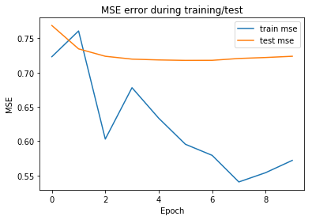

# RMB-for-Collaborative-Filtering
A tensorflow-implementation of the RBM for Collaborative Filtering

This RBM implementation was inspired by the paper Restricted Boltzmann machines for collaborative filtering by Salakhutdinov, R., Mnih, A., and Hinton for the Netflix competition. It was one of the front runners in 2006.

It is trained with the Kaggle movielens-20m-dataset https://www.kaggle.com/grouplens/movielens-20m-dataset. This is a huge dataset to work with, so proper storing of the model parameters on each epoch is important.

The model exposes two main methods: fit and predict.

The error curves are shown next:

For final evaluation, precision, recalll and f1 score were calculated using the test set. A rating greater than 3 is consider positive.

Precision: 0.7106\
Recall: 0.9178\
F1: 0.8010

